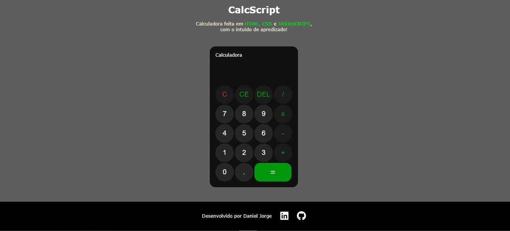

# Calculadora CalcScript

Uma calculadora desenvolvida com **HTML**, **CSS** e **JavaScript**, criada com o objetivo de aprendizado e prática em desenvolvimento web.

## 🔍 Descrição do Projeto

O projeto **CalcScript** é uma calculadora funcional que suporta operações matemáticas básicas, como soma, subtração, multiplicação e divisão. A calculadora possui uma interface amigável, botões interativos e exibe os cálculos em tempo real.

### ✨ Funcionalidades

- Adição, subtração, multiplicação e divisão.
- Botão "C" para limpar tudo.
- Botão "CE" para limpar o último cálculo.
- Botão "DEL" para apagar o último número digitado.
- Suporte a números decimais.
- Resultado atualizado ao clicar em "=".
- Responsividade básica para diferentes tamanhos de tela.

## 🛠️ Tecnologias Utilizadas

- **HTML5**: Estruturação do conteúdo.
- **CSS3**: Estilização e layout.
- **JavaScript ES6+**: Lógica funcional e manipulação do DOM.

## 📂 Estrutura do Projeto

```plaintext
Calculadora-CalcScript/
├── index.html
├── asset/
│   ├── css/
│   │   └── style.css
│   └── js/
│       └── script.js
└── README.md
```

## 📋 HTML

O arquivo `index.html` é o esqueleto do projeto. Ele contém:

- Um título e uma breve descrição.
- A área principal da calculadora com display e botões.
- Um rodapé com links para redes sociais.

## 🎨 CSS

O arquivo `style.css` é responsável pela aparência do projeto, incluindo:

- Estilização dos botões e layout responsivo.
- Cores e fontes para melhor visibilidade.
- Transições suaves ao interagir com os elementos.

## 🔧 JavaScript

O arquivo `script.js` implementa a lógica da calculadora:

- Classes e métodos para processar as operações.
- Eventos de clique para capturar interações com os botões.
- Atualização dinâmica dos displays de cálculo e resultado.

## 🚀 Como Executar o Projeto

1. Faça o download ou clone este repositório:

   ```bash
   git clone https://github.com/danyeljorge/calcscript.git
   ```
2. Abra o arquivo index.html no navegador.

3. Interaja com a calculadora e experimente suas funcionalidades.

### 🖼️ Demonstração



## 🧑‍💻 Autor

Desenvolvido por Daniel Jorge.
Confira mais projetos no meu [GitHub.](https://github.com/danyeljorge)

## 📜 Licença

Este projeto é de código aberto e está sob a licença MIT. 
Sinta-se à vontade para usá-lo e modificá-lo.